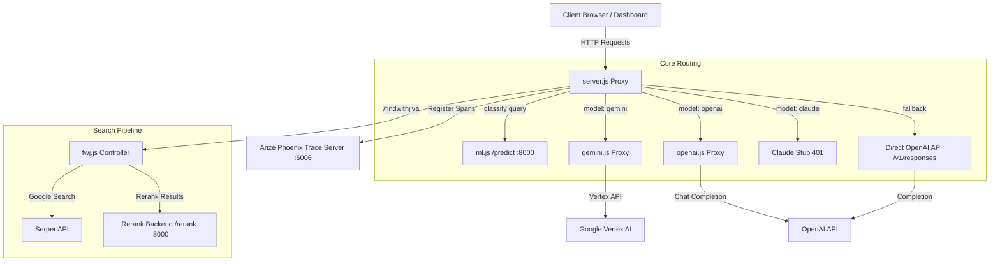

# Jiva AI Proxy Server & PDF Reading Assistant Middleware

A robust Node.js Express middle-tier proxy server that coordinates interactions between client applications, multiple large language model providers (Gemini, OpenAI, Claude), an intent-classification ML engine, a document reranking server, and Google Serper API. 

The service features built-in OpenTelemetry instrumentation integrated with **Arize AI Phoenix** tracing to capture and log OpenInference LLM span telemetry (inputs, outputs, token metrics, system prompts, and tool calls).

---

## 🗺️ Project Architecture & Overview

The Jiva Proxy operates as a central gateway, routing requests and orchestrating tools. It encapsulates several core capabilities:

1. **Intelligent Query Routing & Parsing**: Converts standardized chat payloads into the precise format required by downstream API endpoints (such as Vertex/Gemini or OpenAI).
2. **Intent Classification**: Evaluates input queries against a local classifier (`http://localhost:8000/predict`) to dynamically attach user intent and confidence parameters to prompts.
3. **Google Dorking & PDF Discovery (`findwithjiva`)**: Translates topics into search dorks, retrieves direct PDF links from Google Serper API, and sends results to a local reranking server (`http://localhost:8000/rerank`) to optimize relevance.
4. **Rich Semantic Telemetry**: Tracks requests using `@arizeai/phoenix-otel` and the OpenInference semantic specification, creating structured traces for prompt content, completions, token usage, tool declarations, and exceptions.
5. **Interactive Testing Dashboard**: Provides a unified static web interface for verifying endpoints, benchmarking LLM latencies, and demonstrating the PDF dorking tool.



---

## 📁 Repository Directory Structure

Below is a complete index of all configuration files, models, utility functions, and system prompts. Every file name links directly to its source.

* **Root Directory**
  * [`package.json`](file:///home/yadav/Proxy/package.json): Node.js package description, defining scripts and dependencies.
  * [`tracing.js`](file:///home/yadav/Proxy/tracing.js): Configures OpenTelemetry instrumentation and registers the Arize Phoenix exporter client.
  * [`server.js`](file:///home/yadav/Proxy/server.js): Entry point for the Express application. Establishes server config, middleware, validation, routes, and legacy fallback connections.
  * [`dashboard.html`](file:///home/yadav/Proxy/dashboard.html): Client-side testing panel for latency benchmarking, model comparative reviews, and PDF search results display.
* **`constants/` Directory**
  * [`constants/models.js`](file:///home/yadav/Proxy/constants/models.js): Contains constants defining model identifiers (e.g. `gpt-4o-mini`, `gemini-2.5-flash`) and references to environment API Keys.
  * [`constants/tools.js`](file:///home/yadav/Proxy/constants/tools.js): Defines function calling schema definitions (e.g. navigation, speech synthesis, document search, annotations parser, and clarifications).
  * [`constants/prompts.js`](file:///home/yadav/Proxy/constants/prompts.js): Prompt loading utility which reads markdown prompts from local storage and defines templates for `CHAT`, `ADVANCED_CHAT`, `FINDWITHJIVA`, `CLARIFICATION`, and `SUMMARY`.
* **`constants/systemprompts/` Directory**
  * [`constants/systemprompts/chat.md`](file:///home/yadav/Proxy/constants/systemprompts/chat.md): Base prompt configuration for standard Jiva chat UI. Includes strict plain-text instructions, attention-budget constraints, word limits by chat depth, and rules for the JSON flowchart engine.
  * [`constants/systemprompts/advancedChat.md`](file:///home/yadav/Proxy/constants/systemprompts/advancedChat.md): Chat system prompt equipped for advanced retrieval tool workflows.
  * [`constants/systemprompts/voice.md`](file:///home/yadav/Proxy/constants/systemprompts/voice.md): Audio-first prompt instructions detailing spoken feedback protocol (strictly utilizing `synthesizeSpeech` action tool).
  * [`constants/systemprompts/advancedVoice.md`](file:///home/yadav/Proxy/constants/systemprompts/advancedVoice.md): Voice prompt optimized for tool execution and retrieval-augmented spoken output.
* **`function/` Directory**
  * [`function/fwj.js`](file:///home/yadav/Proxy/function/fwj.js): Module that manages Google Dorking search parameters, makes external calls to Serper, logs telemetry, and hooks into the local reranker.
  * [`function/ml.js`](file:///home/yadav/Proxy/function/ml.js): Classification helper module executing intent prediction on input queries.
* **`models/` Directory**
  * [`models/gemini.js`](file:///home/yadav/Proxy/models/gemini.js): Bridge module adapting prompt payloads and tools for GCP Vertex AI Gemini requests. Integrates OpenTelemetry OpenInference attributes, handles server-sent events (SSE) streaming, and converts functions.
  * [`models/openai.js`](file:///home/yadav/Proxy/models/openai.js): Integration module interfacing with OpenAI's Chat Completions endpoint, including custom span configuration, exception handlers, and streaming SSE line parsers.

---

## ⚙️ Dependencies & Environment Setup

### Prerequisites
1. **Node.js**: Recommended version `v18+`.
2. **Local Machine Learning Backends**: Ensure your local Python microservice is running at `http://localhost:8000` with the following endpoints active:
   * `POST /predict`: Query classification engine.
   * `POST /rerank`: Semantic reranking model.
3. **Arize Phoenix**: To monitor tracing telemetry, ensure Phoenix is running locally or configured at:
   * Target endpoint: `http://localhost:6006/`

### Installation
Clone the repository, navigate into the directory, and install dependencies:
```bash
npm install
```

### Environment Variables (`.env`)
Create a `.env` file in the root of the workspace to configure API credentials and port overrides:
```env
PORT=5050
OPENAI_API_KEY=your_openai_api_key_here
GEMINI_API_KEY=your_google_gemini_api_key_here
SERPER_API_KEY=your_serper_dev_api_key_here
```

### Running the Server
Start the server in development mode using nodemon (auto-reloads on file changes):
```bash
npx nodemon server.js
```
Or start via node directly:
```bash
node server.js
```

---

## 🔗 Express API Reference

### 1. Health Verification
* **Endpoint**: `GET /`
* **Purpose**: Simple check to verify the server is running.
* **Headers**: None
* **Payload**: None
* **Success Response (200 OK)**:
  ```
  The service is working
  ```

---

### 2. General LLM Proxy Completion
* **Endpoint**: `POST /response`
* **Purpose**: Primary proxy routing requests to either Gemini, OpenAI, or Claude. Includes OTEL instrumentation.
* **Payload Fields**:
  * `model` (*string*, optional): `"gemini"` (default), `"openai"`, or `"claude"`.
  * `input` (*Array*, required): List of message objects in standard OpenAI roles format:
    ```json
    [
      { "role": "user", "content": "Explain the concept of quantum computing." }
    ]
    ```
    *Also supports multimodal data packages containing base64 image strings.*
  * `systemtype` (*string*, required): The prompt template configuration. Allowed values:
    * `"chat"` | `"advanced chat"` | `"voice"` | `"advanced voice"` | `"clarification"` | `"summary"` | `"findwithjiva"`
  * `depth` (*string*, optional): Chat depth constraints. Allowed values: `"Focused"`, `"Explorative"`, or `"Deep"`. Affects model temperature configuration and response limits.
  * `userinstruction` (*string*, optional): Additional contextual instructions interpolated into system prompt templates.
  * `userquery` (*string*, optional): The initial search query used for intent classification.
  * `sessionId` (*string*, optional): Session token passed to telemetry spans.
  * `userId` (*string*, optional): User ID passed to telemetry spans.
* **Success Response Schema (200 OK)**:
  * **Gemini Response (Non-Streaming)**:
    ```json
    {
      "content": {
        "parts": [
          { "text": "Model generated response string..." }
        ],
        "role": "model"
      },
      "tools": [
        { "name": "toolName", "args": { "param": "value" } }
      ],
      "userquery": {
        "role": "user",
        "parts": [
          { "text": "{\"userQuery\":\"...\",\"intent\":\"...\",\"confidence\":0.9}" }
        ]
      }
    }
    ```
  * **OpenAI Response (Non-Streaming)**:
    ```json
    {
      "text": "Model generated response string...",
      "toolreturn": {
        "role": "assistant",
        "content": "...",
        "tool_calls": [ ... ]
      },
      "tools": [
        { "name": "toolName", "args": { "param": "value" } }
      ]
    }
    ```
  * **Streaming SSE Responses**:
    If streaming is enabled (e.g. when `systemtype` is `"chat"` or `"advanced chat"` for OpenAI or when configured via stream headers), the response headers will toggle to:
    ```http
    Content-Type: text/event-stream
    Cache-Control: no-cache
    Connection: keep-alive
    ```
    Each SSE packet follows the schema:
    ```
    data: {"text": "next text token..."}
    
    data: {"tool_calls": [{"name": "toolName", "args": {...}}]}
    
    data: [DONE]
    ```
* **Error States**:
  * `400 Bad Request`: Returned if validation fails (e.g. missing `input` parameter in body, or an invalid `systemtype`).
  * `401 Unauthorized`: Returned when invoking the Claude model stub:
    ```json
    {
      "error": "Feature Not Available",
      "message": "Claude is not yet supported"
    }
    ```
  * `500 Internal Server Error`: Returned on backend/LLM failures, network disconnects, or upstream API exceptions.

---

### 3. Jiva PDF Search & Reranking
* **Endpoint**: `POST /findwithjiva`
* **Purpose**: Executes target dorks against Google search indexes. Restricts search strictly to PDF documents and reranks results based on query alignment.
* **Payload Fields**:
  * `input` (*Array*, required):
    ```json
    [
      { "role": "user", "content": "machine learning fundamentals" }
    ]
    ```
  * `sessionId` (*string*, optional): Session metadata.
  * `userId` (*string*, optional): User metadata.
* **Success Response Schema (200 OK)**:
  ```json
  {
    "searchParameters": {
      "q": "filetype:pdf \"machine learning fundamentals\"",
      "type": "search",
      "engine": "google"
    },
    "organic": [
      {
        "title": "Introduction to Machine Learning",
        "link": "https://example.edu/ml-intro.pdf",
        "snippet": "This PDF document provides a review of machine learning fundamentals...",
        "position": 1
      }
    ]
  }
  ```

---

## 🛠️ Codebase Core Function Modules

### 🛠️ Express Controller and Validator
* **`server.js`**
  * [`validateRequest`](file:///home/yadav/Proxy/server.js#L23-L34): Middleware function verifying that POST requests (except `/findwithjiva` and Claude model options) contain a valid `input` property inside the payload body.
  * **Fallback Executor** (Lines 69-112): Processes older client requests that skip provider routing. Fetches completions directly from the OpenAI `v1/responses` endpoint, instruments standard OpenTelemetry spans (`fallback_inference`), and handles raw Event-Stream piping.

### 🔍 Find with Jiva PDF Search Module
* **`function/fwj.js`**
  * [`findwithjiva`](file:///home/yadav/Proxy/function/fwj.js#L5-L97): Coordinates search operations. Generates search dorks by forcing the `filetype:pdf` operator. Instruments OTEL span spans matching the OpenInference semantic spec (`openinference.span.kind = TOOL`), calls Serper API, sends candidate links to the local reranker, and outputs the ordered documents.
  * [`rerank`](file:///home/yadav/Proxy/function/fwj.js#L98-L133): Dispatches search snippets and terms to the reranking service (`http://localhost:8000/rerank`). If the local reranking microservice fails or is unreachable, the function falls back to standard Serper organic ranking.

### 🧠 Intent Classifier Hook
* **`function/ml.js`**
  * [`clssify`](file:///home/yadav/Proxy/function/ml.js#L1-L21): Async function querying the intent classifier model (`http://localhost:8000/predict`). If successful, it extracts the `intent` classification label and the model's `confidence` score. If it fails, it returns default classification values (`"intent was not classified"` with `0` confidence) to ensure prompt pipelines don't halt.

### 🧊 Gemini Model Proxy
* **`models/gemini.js`**
  * [`convertToGemini`](file:///home/yadav/Proxy/models/gemini.js#L10-L100): Adapts standard message arrays into Gemini structure.
    * Calls [`clssify`](file:///home/yadav/Proxy/function/ml.js#L1-L21) to prepend a query classification payload to contents.
    * Bundles consecutive tool response messages into a single user message block to conform with Vertex requirements.
    * Converts multi-part inputs (text, inline images base64 data) into structured inline Vertex parts.
  * [`callgemini`](file:///home/yadav/Proxy/models/gemini.js#L101-L472): Builds system instructions and tools.
    * Determines temperature constraints based on `depth` configuration.
    * Populates semantic OpenInference attributes in the parent OpenTelemetry Span (token counters, tool json schemas, parameters, prompts, structured input-messages, and metadata).
    * Makes HTTP connection to Vertex API.
    * Supports standard JSON response formatting or streaming (by intercepting SSE buffers, parsing JSON candidates, extracting content deltas or tool calls, and yielding stream packets).
  * [`convertParameters`](file:///home/yadav/Proxy/models/gemini.js#L491-L521): Recursively converts JSON Schemas to conform to Vertex tool declarations structure.

### 🕸️ OpenAI Model Proxy
* **`models/openai.js`**
  * [`callopenai`](file:///home/yadav/Proxy/models/openai.js#L10-L344): Coordinates OpenAI integrations.
    * Sets parameters matching request `depth` (temperature and token counts).
    * Registers standard OpenTelemetry spans (`openinference.span.kind = LLM`), setting tracking attributes for tools, prompts, token tallies, output completions, and exception occurrences.
    * Handles completions, supporting both JSON structures and SSE stream buffers (parsing lines, accumulating tool execution tokens, formatting chunk updates, and terminating on `[DONE]` events).

---

## 📡 Telemetry & OpenInference Monitoring Spec

Tracing is configured inside [`tracing.js`](file:///home/yadav/Proxy/tracing.js) which loads before any other files:
```javascript
const { register } = require("@arizeai/phoenix-otel");
const { HttpInstrumentation } = require("@opentelemetry/instrumentation-http");

register({
  url: "http://localhost:6006/",
  projectName: "Proxy",
  instrumentations: [
    new HttpInstrumentation({
      // Ignores all OPTIONS (CORS preflight) requests
      ignoreIncomingRequestHook: (req) => req.method === 'OPTIONS',
      ignoreOutgoingRequestHook: (req) => req.method === 'OPTIONS'
    }),
  ],
});
```

Every model call updates the active OpenTelemetry span context with semantic attributes matching the OpenInference monitoring standard:

| OpenTelemetry Attribute Key | Type | Description | Example Value |
| :--- | :--- | :--- | :--- |
| `openinference.span.kind` | string | Defines span category type | `LLM`, `TOOL` |
| `llm.model_name` | string | Active engine identifier | `gemini-2.5-flash`, `gpt-4o-mini` |
| `llm.provider` | string | Downstream provider namespace | `google`, `openai`, `serper` |
| `llm.system` | string | Target platform library | `vertexai`, `openai` |
| `input.value` | string | Raw payload block serialized as string | `{"contents": [...], ...}` |
| `input.mime_type` | string | Format of input values | `application/json`, `text/plain` |
| `output.value` | string | Raw response block serialized as string | `{"candidates": [...], ...}` |
| `output.mime_type` | string | Format of output values | `application/json`, `text/event-stream` |
| `session.id` | string | Unique identifier for tracking sessions | `user-session-123` |
| `user.id` | string | Unique identifier tracking specific users | `client-user-999` |
| `llm.token_count.total` | integer | Combined prompt + completion tokens | `512` |
| `llm.token_count.prompt` | integer | Number of input prompt tokens | `380` |
| `llm.token_count.completion` | integer | Number of completion response tokens | `132` |
| `llm.tools.[i].tool.json_schema` | string | Serialized JSON schema describing a tool declaration | `{"type": "function", ...}` |
| `llm.input_messages.[i].message.role` | string | Message role inside inputs history | `system`, `user`, `assistant`, `tool` |
| `llm.input_messages.[i].message.content` | string | Message contents string | `"Summarize this page"` |

---

## 🛠️ Tool Definitions Schema Reference

The system prompt configuration maps specific subsets of tools depending on client request `systemtype`:

```json
{
  "voice": ["navigateToPage", "synthesizeSpeech", "readPdfPages"],
  "advanced voice": ["navigateToPage", "synthesizeSpeech", "readPdfPages", "getUserNotesAndHighlights", "getPageContent", "searchPdfContent"],
  "chat": ["navigateToPage"],
  "advanced chat": ["getUserNotesAndHighlights", "getPageContent", "searchPdfContent", "navigateToPage"],
  "clarification": ["clarification"],
  "findwithjiva": ["findwithjiva"]
}
```

Detailed JSON declarations for each function can be found in [`constants/tools.js`](file:///home/yadav/Proxy/constants/tools.js):

### 1. `findwithjiva`
* **Description**: Google PDF search tool.
* **Parameters**:
  * `q` (*string*): The Google Search Query containing `'filetype:pdf'` and other operators (e.g. `site:`, `intitle:`, `inurl:`).

### 2. `navigateToPage`
* **Description**: Changes user focus to the target page in the PDF viewer.
* **Parameters**:
  * `pageNumber` (*integer*): The physical page index.

### 3. `synthesizeSpeech`
* **Description**: Converts custom text to audio speech feedback read aloud to the user.
* **Parameters**:
  * `speech` (*string*): The text content to be read.

### 4. `readPdfPages`
* **Description**: Dedicated document-reading tool.
* **Parameters**:
  * `readpages` (*Array of integers*): List of page indices to read aloud.
  * `allpages` (*boolean*): If true, triggers sequential reading until interrupted.

### 5. `getUserNotesAndHighlights`
* **Description**: Retrieves notes and annotations filtered by keywords or page references.
* **Parameters**:
  * `query` (*string*): Keywords or phrase filters.
  * `pageNumber` (*integer*): Target page reference.

### 6. `getPageContent`
* **Description**: Retrieves raw text contents from target PDF pages.
* **Parameters**:
  * `pageNumbers` (*Array of integers*): List of target pages.

### 7. `searchPdfContent`
* **Description**: Searches the PDF for exact matches, returning matching snippets and page indices.
* **Parameters**:
  * `query` (*string*): Search terms.
  * `range` (*Array of integers*): Limits search scope to specific pages or a boundary range `[start, end]`.

### 8. `clarification`
* **Description**: Delivers explanations of selected sections, tracking word limits and exceptions.
* **Parameters**:
  * `clarification` (*string*): Simple explanation text (maximum 100 words).
  * `error` (*string*): Error description if text is unclear or too long.
  * `errorCode` (*string*, enum): `"USER_SELECTION_NOT_CLEAR"` or `"SELECTION_TOO_LONG"`.

---

## 📝 Prompt Templates & System Guidelines

The server loads prompt rules files from [`constants/systemprompts/`](file:///home/yadav/Proxy/constants/systemprompts/):

### Focus vs. Explorative Depth Controls
* **Focused Mode (Concise)**: Optimized for quick lookups and specific answers. Limits responses:
  * Definitions: 30-70 words
  * Processes: 150-200 words
  * Conceptual: 250-300 words
* **Explorative Mode (Detailed)**: Optimized for deeper analysis, syntheses, and summaries:
  * Definitions: 80-150 words
  * Processes: 300-350 words
  * Conceptual: 400-450 words

### Plain-Text Protocol
* **Strict plain-text execution**: The assistant must never output plain JSON blocks to the user. All outputs must follow standard Markdown structures.
* **Internal Guardrails**: System internals (such as intent matching variables, tool calls, and classification confidence scores) must remain hidden from user responses.

### 📊 Flowchart JSON Engine Specs
When requested to visualize a process or flowchart, the engine must return **only raw JSON** (no Markdown wrapper tags, explanations, comments, or Mermaid syntax):

* **JSON Schema**:
  ```json
  {
    "title": "Flowchart Title",
    "direction": "TD",
    "nodes": [
      {
        "id": "node_id",
        "title": "Label Title (Max 4 words)",
        "subtitle": "Brief concept phrase",
        "type": "start | process | decision | database | subprocess | input | end",
        "class": "success | error | process | warning | database",
        "level": 0
      }
    ],
    "edges": [
      {
        "from": "source_node_id",
        "to": "target_node_id",
        "label": "Edge Label"
      }
    ]
  }
  ```
* **Engine Constraints**: Replace forbidden characters (`%` to `"percent"`, `&` to `"and"`), keep nodes vertically structured by level (Start at level 0, sub-processes at level 2+), and ensure all node IDs are unique.

---

## 📊 Testing Dashboard Guide

The repository includes [`dashboard.html`](file:///home/yadav/Proxy/dashboard.html), an interactive dashboard to test integration and performance metrics.

```
       ┌────────────────────────────────────────────────────────┐
       │             Model Proxy Performance Dashboard          │
       ├────────────────────────────────────────────────────────┤
       │ Test Prompt: [ Hello, explain photosynthesis...      ] │
       │                                                        │
       │ Models to Test:   [X] Gemini   [X] OpenAI   [ ] Claude │
       │                                                        │
       │ System Type: [chat  ▼]            Depth: [Focused  ▼]  │
       │                                                        │
       │ ┌────────────────────────────────────────────────────┐ │
       │ │                 [Run Performance Test]             │ │
       │ └────────────────────────────────────────────────────┘ │
       │                                                        │
       │ Results:                                               │
       │ ┌─────────┬─────────┬───────────────┬────────────────┐ │
       │ │ Model   │ Status  │ Response Time │ Snippet        │ │
       │ ├─────────┼─────────┼───────────────┼────────────────┤ │
       │ │ gemini  │ Success │ 412 ms        │ Photosynthe... │ │
       │ │ openai  │ Success │ 685 ms        │ Photosynthe... │ │
       │ └─────────┴─────────┴───────────────┴────────────────┘ │
       └────────────────────────────────────────────────────────┘
```

1. **How to run the dashboard**:
   * Open the [`dashboard.html`](file:///home/yadav/Proxy/dashboard.html) file directly in a web browser, or host it locally.
   * Ensure your proxy server is active at `http://localhost:5050` (otherwise calls will fail with network errors).
2. **General Performance Testing**:
   * Enter a test prompt inside the text field.
   * Select the target model checkboxes (Gemini, OpenAI, Claude).
   * Configure the System Type configuration matching the context you want to mock.
   * Click **Run Performance Test** to send parallel requests. The table will update dynamically showing the model status, latency (in milliseconds), and a response preview.
3. **Find with Jiva (PDF Finder Demo)**:
   * Scroll to the **Find with Jiva** card.
   * Type in a research topic or document query.
   * Click **Find PDFs**. The page will show the Google search results returned from the proxy (queried via Serper and reordered using the local reranker backend).
